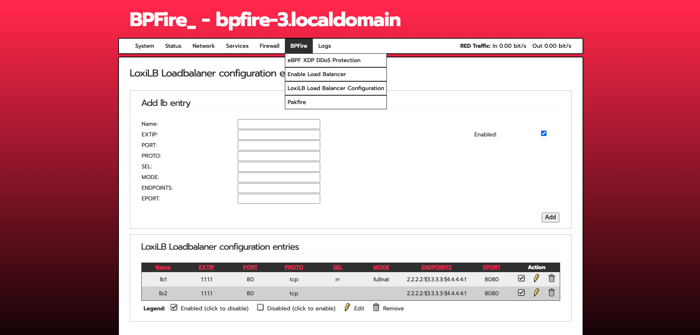
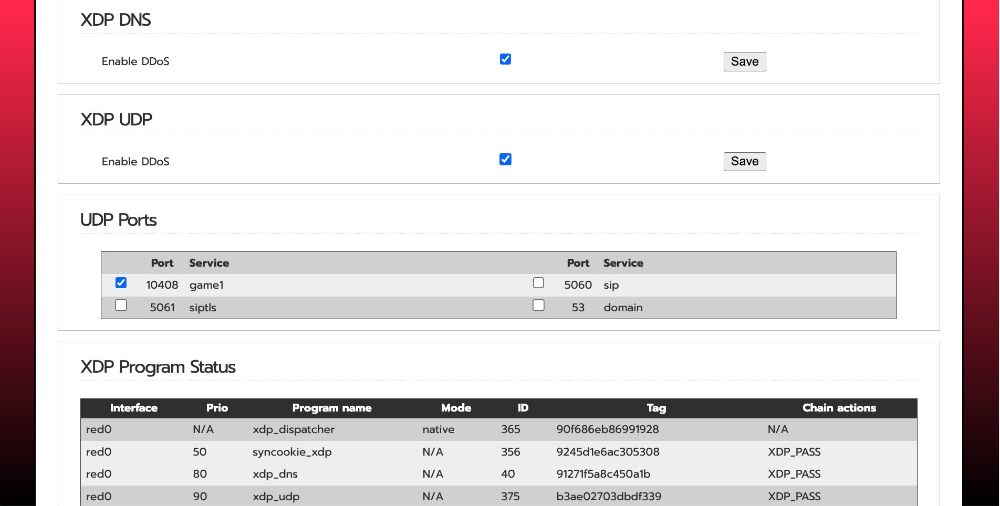
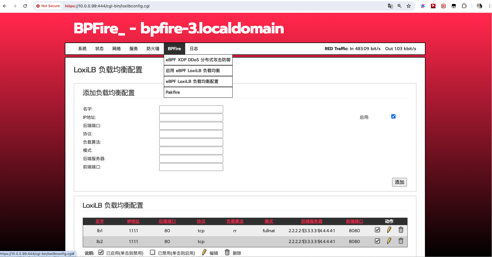
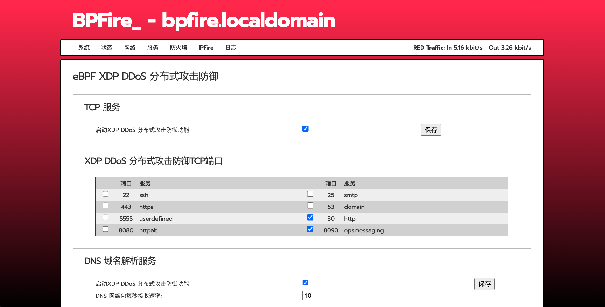
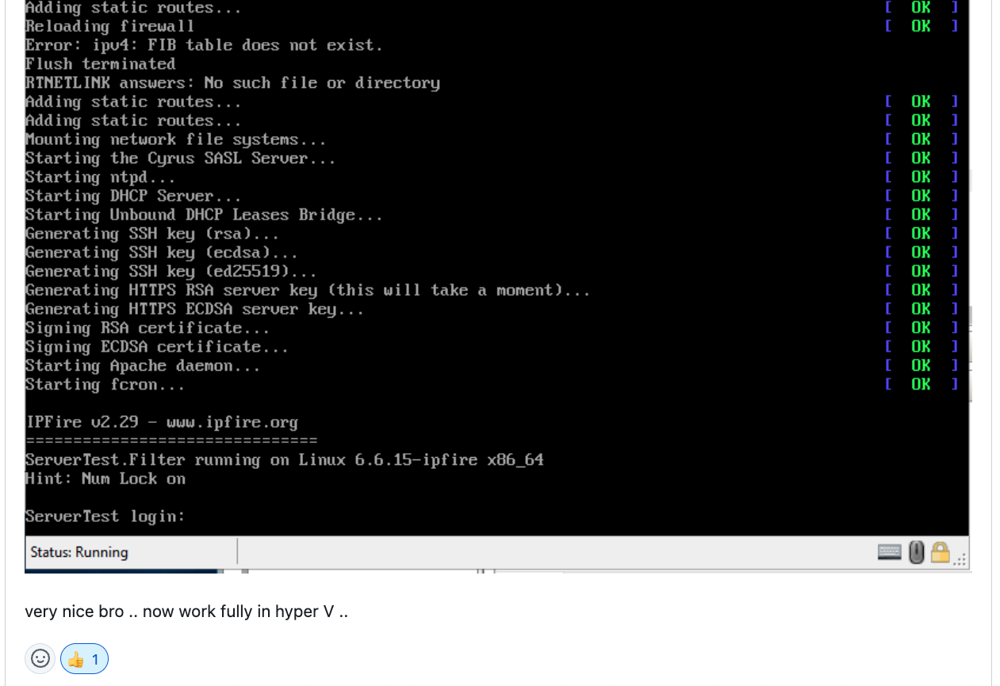

# BPFire - eBPF Network Firewall and Load Balancer

# What is BPFire?

BPFire is fork of IPFire 2.x, a hardened, versatile, state-of-the-art Open Source firewall based on Linux. BPFire is an eBPF networking centric Linux OS distribution that is easy for users to install and use. Current supported eBPF network application features:

1. XDP DDoS protection, See XDP SYNPROXY stops 10G DDoS SYN flood [here](https://www.youtube.com/watch?v=81Hgoy-x1A4)
2. eBPF based LoxiLB load balancer, overall load balancer features located [here](https://loxilb-io.github.io/loxilbdocs/#overall-features-of-loxilb)

# Where can I get BPFire installation image?

https://drive.google.com/drive/folders/1HPJTWP6wi5gPd5gyiiKvIhWipqguptzZ?usp=drive_link

# How do I use this software?

BPFire XDP DDoS feature demo:

IPFire have a long and detailed wiki located [here](https://wiki.ipfire.org/) which
should answers most of your questions for IPFire.

# BPFire SYNPROXY throughput with and without XDP acceleration under 10Gbit DDoS SYN flood:

# BPFire WebUI screenshot:

English:

Chinese:

# Does BPFire run in hypervisor virtual environment?

Yes, We have tested in Linux KVM hypervisor, Proxmox, Microsoft Hyper-v, should support Virtualbox, VMware as well.

Microsoft Hyper-v screen shot:

# But I have some questions left. Where can I get support?

You can ask your question by open github issue report or discussion or
You can ask your question at ipfire community located [here](https://community.ipfire.org/) that is IPFire related.

# How to build BPFire?

Build Environment Setup https://www.ipfire.org/docs/devel/ipfire-2-x/build-initial

git clone https://github.com/vincentmli/BPFire.git

cd BPFire

git checkout bpfire

get BPFire source tar balls https://drive.google.com/file/d/1YjTzik4xw0JxFDldLZdVw1GthXG5QrS_/view?usp=drive_link

tar xvf cache.tar

./make.sh build
